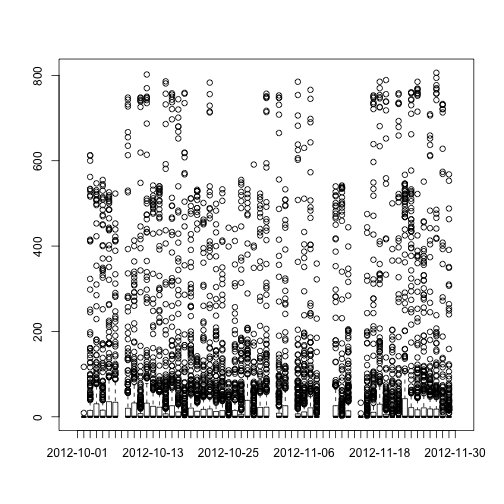
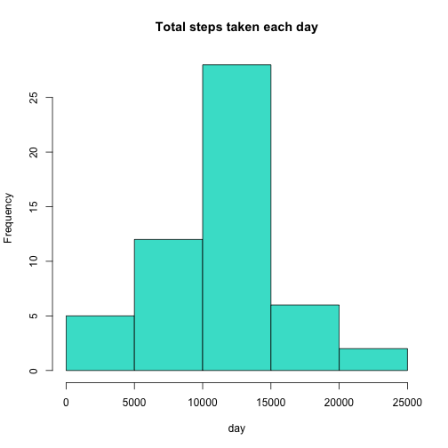
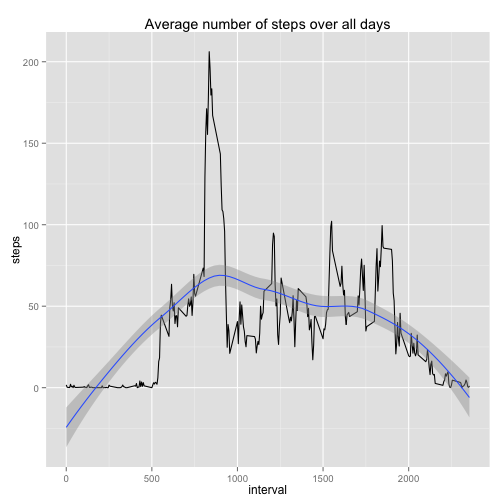
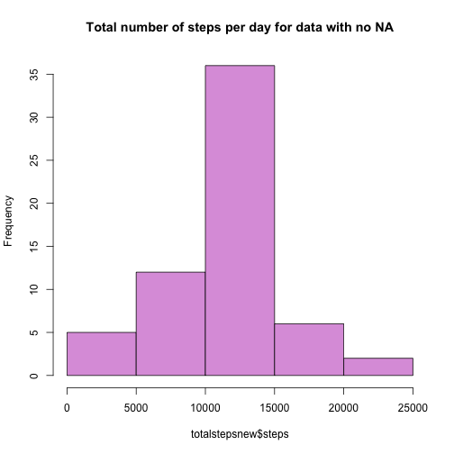
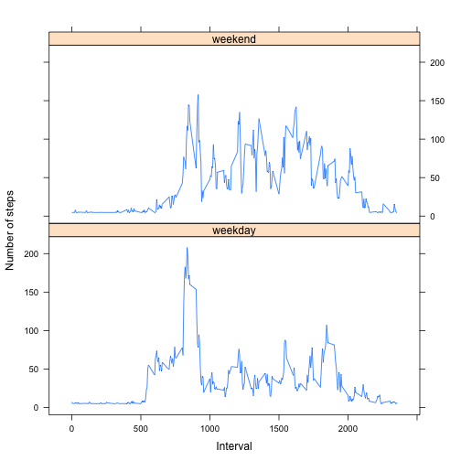

---
output:
  html_document: default
---
Peer Assessment 1
==================

In this assignment, we analyze data about personal movement from activity monitoring devices. This first code chunk will download the data and load it into the workspace

```r
if(!file.exists("repdata-data-activity.zip")){
        fileURL <- "https://d396qusza40orc.cloudfront.net/repdata%2Fdata%2Factivity.zip"
        download.file(url = fileURL, destfile = "repdata-data-activity.zip", method = "curl")
        downloadDate <- date()
        unzip(zipfile = "repdata-data-activity.zip")
        }
data <- read.csv(file = "activity.csv")
```

Next we will do some quick exploratory data analysis

```r
names(data)
```

```
## [1] "steps"    "date"     "interval"
```

```r
str(data)
```

```
## 'data.frame':	17568 obs. of  3 variables:
##  $ steps   : int  NA NA NA NA NA NA NA NA NA NA ...
##  $ date    : Factor w/ 61 levels "2012-10-01","2012-10-02",..: 1 1 1 1 1 1 1 1 1 1 ...
##  $ interval: int  0 5 10 15 20 25 30 35 40 45 ...
```

```r
summary(data)
```

```
##      steps                date          interval     
##  Min.   :  0.00   2012-10-01:  288   Min.   :   0.0  
##  1st Qu.:  0.00   2012-10-02:  288   1st Qu.: 588.8  
##  Median :  0.00   2012-10-03:  288   Median :1177.5  
##  Mean   : 37.38   2012-10-04:  288   Mean   :1177.5  
##  3rd Qu.: 12.00   2012-10-05:  288   3rd Qu.:1766.2  
##  Max.   :806.00   2012-10-06:  288   Max.   :2355.0  
##  NA's   :2304     (Other)   :15840
```

```r
plot(data$date, data$steps)
```

 

What is the mean total number of steps taken per day?

```r
totalsteps <- aggregate(steps ~ date, data = data, FUN = sum)
hist(totalsteps$steps, main = "Total steps taken each day", xlab = "day", col = "turquoise")
```

 

```r
mean(totalsteps$steps)
```

```
## [1] 10766.19
```

```r
median(totalsteps$steps)
```

```
## [1] 10765
```

What is the average daily activity pattern?

```r
avgsteps <- aggregate(steps ~ interval, data = data, FUN = mean)
library(ggplot2)
ggplot(avgsteps) + geom_line(aes(x = interval, y = steps)) + geom_smooth(aes(x=interval,y=steps)) + ggtitle(label = "Average number of steps over all days")
```

```
## geom_smooth: method="auto" and size of largest group is <1000, so using loess. Use 'method = x' to change the smoothing method.
```

 

```r
maximum <- which(grepl(max(avgsteps$steps), avgsteps$steps))
avgsteps[maximum,]
```

```
##     interval    steps
## 104      835 206.1698
```
Maximum number of steps seems to be between 8:35am and 8:40am

Imputing missing values

```r
missing <- sum(is.na(data$steps))
missing
```

```
## [1] 2304
```

We'll use the mean step for all days to replace missing values in a new dataset

```r
data2 <- data
na_ID <- which(is.na(data2$steps))
means <- rep(mean(data2$steps, na.rm = TRUE), times = length(na_ID))
data2[na_ID, "steps"] <- means
```

Make a histogram of the total number of steps taken each day, then caluculate mean, median for the total number of steps taken each day

```r
totalstepsnew <- aggregate(steps ~ date, data = data2, FUN = sum)
hist(totalstepsnew$steps, main = "Total number of steps per day for data with no NA", col = "plum")
```

 

```r
mean(totalstepsnew$steps)
```

```
## [1] 10766.19
```

```r
median(totalstepsnew$steps)
```

```
## [1] 10766.19
```
After substituting in the mean for NA values, the mean and the median are exactly the same instead of having a difference of 1.19 as in above

Create a new factor variable in the dataset with two levels – “weekday” and “weekend” indicating whether a given date is a weekday or weekend day.

```r
library(dplyr)
```

```
## 
## Attaching package: 'dplyr'
## 
## The following object is masked from 'package:stats':
## 
##     filter
## 
## The following objects are masked from 'package:base':
## 
##     intersect, setdiff, setequal, union
```

```r
data2$date <- as.Date(data2$date)
data2 <- mutate(data2, day = weekdays(date)) 
data2$day <- ifelse(data2$day %in% c("Saturday", "Sunday"),"weekend","weekday")
data2[sample(1:dim(data2)[1], size = 5),]
```

```
##       steps       date interval     day
## 15206   484 2012-11-22     1905 weekday
## 13284     0 2012-11-16      255 weekday
## 1348      0 2012-10-05     1615 weekday
## 15069    15 2012-11-22      740 weekday
## 6339      0 2012-10-23       10 weekday
```

```r
data2$day <- factor(data2$day)
stepsPerDay <- aggregate(steps ~ interval + day, data = data2, mean)
library(lattice)
xyplot(x = steps ~ interval | day, data = stepsPerDay, type = "l", layout = c(1,2), ylab = "Number of steps", xlab = "Interval")
```

 

Our graphs reveal that fewer steps are taken during weekdays than over weekend days, posibly due to the fact that our anonymous person has more time to walk on weekends
